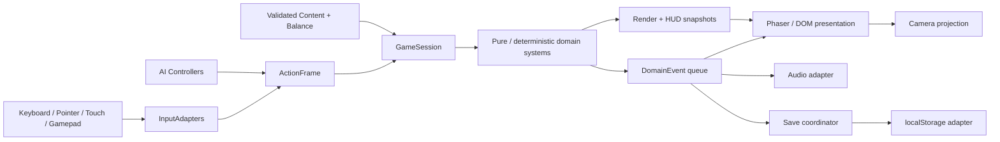

# ARCHITECTURE — Project Sandstrike

Status: **Phase A specification approved on 2026-10-01; Phase B and Phase C
functional prototypes implemented. Physical-device release gate remains pending.**

Last updated: 2026-10-02

This document defines the implementation boundaries for the approved staged,
two-role MVP. It turns the accepted product direction in `docs/GAME_DESIGN.md`
into implementation contracts. Sections below retain the approved specification;
implementation notes are appended. Actual evidence is in PHASE_C_VERIFICATION.md.

## 1. Decision status

### Accepted baseline

- The MVP is browser-first and static-host compatible, with no mandatory backend.
- Phase B will pin `phaser@4.2.1` and use TypeScript, Vite, and npm. The exact
  compatible versions of the remaining tools will be verified and pinned when
  scaffolding begins; `package-lock.json` will be committed.
- The MVP adds no React dependency unless measured DOM complexity justifies a
  later reviewed decision.
- Runtime NPC behavior uses deterministic finite-state machines, utility scoring,
  steering/prediction, and seeded randomness. It never calls an LLM or remote AI.
- Desktop, touch, and gamepad adapters feed one gameplay action interface and one
  simulation. Device-specific behavior stays at the input and presentation edges.
- The domain model owns gameplay truth. Phaser scenes coordinate presentation and
  lifecycle; they do not own score rules, AI decisions, save rules, or balance.
- The worm head owns locomotion. Body segments sample a stable history of the
  head's path and do not simulate independent rigid bodies.
- Logical collision shapes are independent of sprite dimensions.
- Content and balance are data-driven. Reusable systems do not switch on concrete
  character names.
- MVP persistence uses a versioned `localStorage` document with explicit pure
  migrations and a safe in-memory fallback.
- Vitest covers deterministic domain behavior. Playwright covers browser-critical
  flows and representative desktop/mobile layouts.
- All shipped assets are original, project-generated, or compatibly licensed and
  recorded in `docs/ASSET_LICENSES.md`.

### Provisional choices to validate in early Phase B spikes

These choices are the current implementation direction, not promises that they
will survive measurement unchanged:

1. Use a fixed 60 Hz domain step with render interpolation and a capped catch-up
   loop. Validate low-refresh and throttled mobile browsers before locking it.
2. Use Phaser Arcade Physics behind an adapter for ordinary actors and projectiles,
   plus explicit swept tests for the fast worm head. Replace only the failing part
   if high-speed contacts or replay stability are unreliable.
3. Compare a small plain-DOM shell with a Phaser/DOM hybrid for menus, blocking
   overlays, and orientation guidance. Either choice must retain semantic DOM
   controls for accessibility-critical navigation. Touch controls may be DOM
   overlays or Phaser objects after an ergonomics/performance comparison; both
   must implement the same input port.
4. Start with the performance and content budgets in section 16. Tighten or relax
   them only from measurements on documented devices.
5. Use a mostly flat surface with a `TerrainProfile` interface. Complex deformable
   terrain remains outside the MVP.

Any change to an accepted baseline requires a newer entry in
`docs/DECISIONS.md`. A provisional choice can be resolved in that log after its
spike records evidence and trade-offs.

## 2. Architectural goals

The architecture exists to protect five properties:

1. **Convincing movement:** worm steering, breach, re-entry, and body follow can be
   tuned without scene or rendering dependencies.
2. **Real role asymmetry:** Rampage and Hunt share world primitives but have
   separate rules, objectives, controllers, and HUD priorities.
3. **Cross-platform parity:** the same gameplay action has the same semantic result
   regardless of the physical control that produced it.
4. **Inspectable behavior:** a seed, simulation tick, input frames, domain events,
   and AI decisions provide enough evidence to reproduce a failure.
5. **Incremental delivery:** Phase B can ship the worm slice without speculative
   campaign infrastructure, while Phase C can add Ranger and worm AI without
   rewriting the simulation.

The MVP deliberately avoids a generic entity-component framework, service
container, runtime plugin system, network layer, and destructible-terrain engine.
Small typed aggregates and focused systems are easier to inspect at this scale.

## 3. Dependency boundaries



Dependencies point inward:

- `domain` imports no Phaser, DOM, Web Audio, storage, or browser APIs.
- `application` coordinates sessions through domain interfaces and ports.
- `infrastructure` implements input, storage, audio, collision, and clock ports.
- `presentation` consumes read-only snapshots/events and forwards physical input.
- scenes compose modules but may not reach into another module's private state.
- data modules contain definitions and values, never scene references or behavior.

Phaser-specific types stop at adapters and view objects. A deterministic test must
be able to construct a `GameSession` using a fake clock, fake collision adapter,
seeded random source, and scripted `ActionFrame` values without booting a canvas.

## 4. Proposed source layout

The tree is a target for later phases, not a scaffold created in Phase A.

```text
src/
  app/
    AppShell.ts
    NavigationCoordinator.ts
    PauseCoordinator.ts
  game/
    config/
      buildConfig.ts
      runtimeConfig.ts
    domain/
      session/
        GameSession.ts
        SimulationClock.ts
        RunConfig.ts
      actors/
        Actor.ts
        worm/
        hunter/
        enemies/
      movement/
        WormLocomotion.ts
        PathHistory.ts
        HunterLocomotion.ts
      combat/
        CombatSystem.ts
        DamageResolver.ts
      collision/
        CollisionWorld.ts
        CollisionTypes.ts
      scoring/
        ScoreSystem.ts
        ComboSystem.ts
      spawning/
        SpawnDirector.ts
        ThreatDirector.ts
      modes/
        ModeRules.ts
        RampageRules.ts
        HuntRules.ts
      abilities/
        Ability.ts
        AbilitySystem.ts
      ai/
        perception/
        states/
        utility/
        steering/
      events/
        DomainEvent.ts
        EventQueue.ts
      random/
        RandomSource.ts
      math/
    application/
      SessionController.ts
      RunFactory.ts
      SaveCoordinator.ts
    input/
      ActionFrame.ts
      InputSource.ts
      InputRouter.ts
      KeyboardMouseInput.ts
      TouchInput.ts
      GamepadInput.ts
      AIInput.ts
    infrastructure/
      phaser/
        PhaserCollisionAdapter.ts
        PhaserAudioAdapter.ts
        PhaserClockAdapter.ts
      storage/
        LocalStorageSaveRepository.ts
        MemorySaveRepository.ts
    scenes/
      BootScene.ts
      PreloadScene.ts
      GameplayScene.ts
    rendering/
      WorldRenderer.ts
      ActorViews.ts
      EffectsRenderer.ts
      CameraController.ts
    ui/
      hud/
      touch/
      debug/
    data/
      characters.ts
      abilities.ts
      enemies.ts
      modes.ts
      balance.ts
      assets.ts
    save/
      SaveData.ts
      SaveMigrations.ts
      SaveValidation.ts
    debug/
      DebugSnapshot.ts
      DebugOverlay.ts
    utils/
  styles/
  main.ts
tests/
  unit/
  integration/
  e2e/
public/
  assets/
```

Folders should be introduced only when their first focused module is needed.
Phase B must not create empty abstractions for all later phases.

## 5. Runtime composition and scene responsibilities

### Browser shell

`AppShell` owns the canvas host, loading/error state, orientation guidance,
safe-area CSS variables, and page-level gesture policy. The selected menu adapter
supplies semantic DOM controls for accessibility-critical navigation. Neither may
mutate gameplay actors. `NavigationCoordinator` is the only place that translates
a menu choice into a scene/session transition.

### Phaser scenes

- `BootScene` configures scale, lifecycle listeners, and the minimal loading view.
- `PreloadScene` loads the asset manifest, reports failures, and hands control to
  the shell/menu only after required assets are ready.
- `GameplayScene` composes `GameSession`, renderers, cameras, and adapters. Its
  update method collects input, advances the session, renders a snapshot, and
  drains presentation events. It contains no role-specific rules.

Title, main menu, role/mode selection, settings, credits, pause, and results are
navigation states. Whether their visual layer uses plain DOM or a Phaser/DOM
hybrid is provisional; these states and transitions remain the same. The MVP has
no inactive character, upgrade, achievement, or loadout screens.

Pause is an overlay plus a pause reason, not a second live simulation. Results are
built from an immutable `RunResult`; returning to menu destroys the old session.

### Session lifecycle

```text
RunConfig + validated definitions + seed
  -> RunFactory
  -> GameSession.initialize()
  -> fixed simulation ticks
  -> RunResult
  -> SaveCoordinator
  -> Results view
```

Only `RunFactory` creates role/mode combinations. The Phase B factory supports the
Rampage slice; Phase C adds Hunt composition. Unknown or invalid IDs fail before a
session begins and produce a recoverable menu error.

## 6. State ownership

| State | Single owner | Read/write policy |
|---|---|---|
| Navigation and active screen | `NavigationCoordinator` | Views request transitions; they do not set state directly. |
| Active run, actors, objectives, score | `GameSession` | Mutated only during fixed simulation ticks. Views receive snapshots. |
| Actor movement, health, cooldowns | Actor aggregate plus focused systems | Commands enter through `ActionFrame`; systems emit events. |
| Mode win/loss and objectives | `ModeRules` | Observes domain events and session facts; returns objective state. |
| Input device state | Individual input adapter | Normalized each tick by `InputRouter`; never queried by actors. |
| Pause reasons | `PauseCoordinator` | A set of reasons; simulation resumes only when all are cleared. |
| Persistent player data | `SaveCoordinator` | Loaded once, validated/migrated, written at defined checkpoints. |
| Presentation objects | Phaser renderers / DOM views | Rebuilt from IDs and snapshots; never authoritative for gameplay. |
| Audio playback | Audio adapter | Triggered by presentation events; no gameplay decisions depend on playback. |
| Debug state | `DebugSnapshot` producer | Read-only mirror; debug UI cannot mutate production state except documented tools. |

There is no mutable global `gameState`. Process-wide configuration is immutable
after boot. Every active run has a unique session ID, seed, and monotonically
increasing simulation tick.

## 7. Simulation and data flow

The proposed simulation step is 1/60 second:

1. `InputRouter` samples every active source into one `ActionFrame` per controlled
   actor. Edge transitions (`pressed`, `released`) are derived once.
2. Controllers validate actions against role, status, cooldowns, and mode rules.
3. AI perception snapshots are refreshed at their configured cadence. AI produces
   the same action contract used by human-controlled actors.
4. Locomotion advances actors. The worm head writes ordered path samples before
   follower poses are resolved.
5. Collision broad-phase and swept queries produce normalized contacts.
6. Contacts are sorted by stable entity ID and contact kind, then combat and
   interaction systems resolve them in a defined order.
7. Domain events update score, combo, threat, objectives, and spawn queues.
8. Deferred spawns/despawns are committed after event resolution.
9. A read-only render/HUD/debug snapshot is published.

The real-time loop uses an accumulator, caps elapsed input after interruptions,
and permits at most a small configured number of catch-up steps per render. If the
cap is exceeded, the session records a diagnostic and drops excess accumulated
time instead of allowing an unbounded spiral. Visual interpolation never feeds
back into domain positions.

`DomainEvent` values are typed records such as `ActorDamaged`, `TargetConsumed`,
`BreachStarted`, `BreachHit`, `TrapTriggered`, `ComboChanged`, `ThreatTierChanged`,
`ObjectiveChanged`, and `RunEnded`. They carry IDs and immutable values rather
than Phaser objects. A bounded per-tick queue prevents recursive event storms.

## 8. Input action layer

The shared semantic action frame has these conceptual fields:

| Group | Actions | Notes |
|---|---|---|
| Movement | `moveX`, `moveY` | Normalized `[-1, 1]`; worm interprets this as steering intent, hunter as surface movement. |
| Aim | `aimX`, `aimY`, optional world aim point | Mouse/touch world coordinates are converted at the presentation boundary. |
| Combat | `primary`, `secondary`, `ability` | Each exposes held/pressed/released where needed. |
| Mobility | `boost` | Worm burst and hunter dodge may map to the same semantic slot with role-specific ability data. |
| Context | `interact` | Disabled in modes that do not define it. |
| Navigation | `pause`, `confirm`, `back` | Consistent across keyboard, touch, and gamepad. |

`InputRouter` merges sources with explicit rules:

- The most recently active pointing source owns aim until another source moves
  beyond a dead zone.
- Analog values apply dead zones and response curves in the adapter, then are
  clamped by the router.
- Button edges can fire only once per simulation tick even if two devices map to
  the same action.
- Opening pause clears held gameplay actions. Resuming requires a fresh press.
- Touch pointers are captured by control region so a joystick finger cannot also
  activate an action button.
- AI and replay/scripted input use separate `InputSource` implementations, not
  special cases inside actors.

Keyboard defaults and touch layouts belong in data/config. Rebinding is not
required for the first vertical slice, but action IDs and display labels must not
assume hard-coded keys.

## 9. Responsive canvas, HUD, and touch behavior

The simulation uses a logical world measured in world pixels. CSS/canvas resizing
changes only projection and visible camera bounds; it never scales physics values,
speeds, hitboxes, or balance.

`ViewportLayout` takes CSS viewport size, device pixel ratio, safe-area insets,
orientation, input capability, and role. It returns named regions for world view,
HUD, touch steering, action buttons, pause, and blocking overlays. Layouts are
selected by constraints rather than user-agent detection.

- Desktop targets landscape 16:9, 16:10, and ultrawide without stretching the
  world. Extra width reveals only a bounded safe amount of arena.
- Phone/tablet gameplay is landscape-first. Touch targets aim for 48 CSS pixels,
  never fall below 44 CSS pixels, and increase when spacing permits.
- Safe-area insets apply to all interactive regions. Controls may not cover the
  player's immediate threat/target focus region.
- A portrait viewport displays a clear orientation overlay and adds an
  `orientation` pause reason. Menus remain usable in portrait.
- Resize and orientation events are debounced for layout work, but the canvas
  projection updates before the next rendered frame.
- During active touch gameplay the canvas/control surface uses an appropriate
  `touch-action` policy and prevents page scroll/zoom only inside that surface.
- HUD density is role-specific: Rampage prioritizes health, combo, threat, and
  score; Hunt prioritizes health, ammo/cooldowns, tracking signal, trap state, and
  objective health/time.

The camera follows a smoothed focus target but does not own actor movement.
Rampage focus anticipates head velocity and breach direction. Hunt focus favors
the hunter while allowing a bounded look-ahead toward tracking or breach cues.
Camera shake is an additive presentation effect with intensity and disable/reduce
settings; it never changes world-to-input conversion.

## 10. Coordinate, terrain, and collision model

### Coordinate spaces

- World coordinates use floating-point pixels, positive X right, positive Y down.
- Screen/CSS coordinates exist only in input and rendering adapters.
- `CameraProjection` is the only converter between screen and world coordinates.
- `TerrainProfile.surfaceY(x)` defines the surface. The first arena may return a
  nearly flat value; callers must not assume a global constant.
- Underground/surface state uses a configurable margin and hysteresis around the
  logical head shape to prevent rapid state flipping at the boundary.

### Worm path history

`WormLocomotion` owns authoritative head position, heading, speed, angular
velocity, and movement phase (`underground`, `breaching`, `airborne`, `reentering`).
It records distance-aware samples containing position, tangent, and cumulative
path distance. Each segment resolves its pose at a target distance behind the head
through interpolation between samples.

Path history requirements:

- sampling is based on distance with a maximum time gap, avoiding segment bunching
  when speed changes;
- history capacity covers the full body plus a safety margin and uses a ring
  buffer, not an ever-growing array;
- teleports/resets explicitly rebuild history;
- body pose calculation is render-independent and unit-testable;
- followers never apply forces back to the head;
- visual smoothing cannot move a logical hurtbox outside its documented tolerance.

Gravity and reduced air steering apply only in airborne phases. Breach and re-entry
are detected from a swept head trajectory crossing the terrain profile, not from a
single-frame sprite overlap.

### Collision shapes and categories

The initial shape set is circles, capsules/line segments, and axis-aligned boxes.
Definitions provide offsets and dimensions separately from art. Collision masks
distinguish worm attack, worm hurtbox, hunter, prey, enemy, vehicle, projectile,
trap, world bound, and trigger volumes.

The worm head is the authoritative movement/attack shape. Body segments expose a
reduced set of hurt capsules for Hunt when needed; decorative segments do not each
become full dynamic physics bodies. Fast heads and projectiles use swept queries or
bounded substeps to avoid tunneling.

Contact resolution order is stable:

1. world bounds and terrain transition;
2. blocking movement contacts;
3. trap/trigger contacts;
4. damage and consumption contacts;
5. score/objective consequences;
6. deferred removal.

An entity can be consumed or destroyed only once. Damage events carry source,
target, ability, tick, amount, and tags so scoring and objectives never infer a
cause from sprite state.

## 11. Actors, modes, combat, and abilities

An actor aggregate contains identity, faction, definition ID, transform, logical
collision profile, health/status, controller reference, and capability components
needed by that actor. Rendering data is resolved separately from its definition ID.

`ModeRules` owns allowed roles, objectives, spawn profile, end conditions, and the
construction of `RunResult`:

- `RampageRules` treats the player worm as predator and drives escalating world
  response, score, combo, survival, and death/restart.
- `HuntRules` treats Ranger as the player, creates an AI worm, tracks the protected
  relay, and ends on worm defeat, hunter defeat, or relay destruction. Its mode
  contract may support timed objectives later, but the MVP Hunt rules do not.

Shared combat uses commands and typed damage/contact events. Role-specific reward
tables and objective handlers consume those events; they do not branch inside the
base damage resolver.

Abilities are instantiated from validated definitions with stable fields for ID,
owner restrictions, cooldown, optional resource cost, activation conditions,
execution strategy ID, telemetry/debug tags, and VFX/SFX hook IDs. Concrete
execution strategies are registered by ID. Adding a character should primarily
add definitions and small strategies, not a character-name switch statement.

## 12. AI and deterministic randomness

Every AI controller receives a read-only `PerceptionSnapshot` containing only
facts that its role may know: visible actors, recent cues, objective state, health,
cooldowns, and predicted intercepts. It cannot inspect scene objects or hidden
player input.

The control pipeline is:

```text
Perception -> macro FSM -> eligible actions -> utility scores
           -> selected intent -> steering/prediction -> ActionFrame
```

Macro states prevent implausible oscillation; utility scoring chooses among actions
within the current context. Transitions have named reasons, minimum dwell times or
hysteresis where needed, and pure tests. Expensive perception/utility updates can
run at a lower configured cadence while steering continues each simulation tick.

One seeded random service is created per run. Independent named streams (spawn,
AI, loot/effects where gameplay-relevant) are derived from the run seed so adding a
cosmetic random call cannot change enemy behavior. Presentation-only randomness
uses a separate source and never affects game state.

The debug snapshot exposes for each AI actor: macro state, selected action, target,
top utility scores, transition reason, cooldowns, perceived cues, prediction point,
and steering vector. A recorded seed plus scripted action frames must reproduce
domain decisions within the supported build; cross-version replay compatibility is
not an MVP promise.

## 13. Content and balance data

Definitions are immutable after a run begins and keyed by stable, namespaced IDs.
Initial data groups are:

- character definitions and base stats;
- ability definitions and cooldown/resource data;
- enemy definitions and behavior profiles;
- mode/objective and spawn tables;
- collision profiles;
- score/combo event values;
- threat tiers and pacing curves;
- camera, feedback, accessibility, and input defaults;
- asset manifest entries.

Runtime validators reject duplicate IDs, missing references, invalid ranges,
impossible collision masks, and role-incompatible loadouts during boot/tests. Do
not scatter tunable numbers through scenes or strategies. `docs/BALANCE.md` records
the rationale and history for material changes; the runtime source remains the
typed balance data.

Phase B should introduce only the definitions required for the vertical slice.
The full five-character target and later modes are extension tests for the schema,
not a reason to populate unused content.

## 14. Save and persistence architecture

The MVP stores durable preferences and results, not a live mid-run snapshot. The
initial envelope conceptually contains:

- schema version and last-written application version;
- settings and accessibility preferences;
- best scores/stat summaries keyed by mode and character;
- onboarding/tutorial flags.

The MVP schema contains no currency, upgrade, achievement, or unlock economy
fields. Those features require a later schema version and explicit migration.

`SaveRepository` exposes load and replace operations. Only `SaveCoordinator` knows
when to write: after a changed setting, accepted run result, explicit reset, or
migration. Gameplay systems never call `localStorage`.

Loading follows this order:

1. parse the primary document without trusting its shape;
2. validate envelope and supported schema version;
3. apply one pure migration at a time;
4. validate the fully migrated result;
5. fall back to a last-known-good backup or defaults if corrupt;
6. report a nonfatal diagnostic and keep playing through an in-memory repository
   if storage is unavailable or quota/security access fails.

Writes serialize a complete validated document, preserve the previous valid value
as a backup, and then replace the primary value. The concrete key includes the
project namespace and environment so development data cannot overwrite production
data. Tests cover empty, corrupt, future-version, and every supported migration
fixture. Resetting data requires an explicit UI confirmation during implementation.

## 15. Pause, interruptions, and recovery

`PauseCoordinator` maintains a set of reasons: `user`, `visibility`, `focus`,
`orientation`, and `system`. Simulation and gameplay timers advance only when the
set is empty. Audio suspends whenever the session is paused.

- `visibilitychange` adds/removes the visibility reason. Returning to the tab
  displays a resume affordance rather than immediately applying held input.
- Blur, controller disconnect, and touch interruption clear active input states.
- Unsupported portrait gameplay adds the orientation reason; rotation back to
  landscape retains the user-pause reason if it was already active.
- Resize does not restart the run or alter world coordinates.
- A very large real-time delta is discarded before the accumulator runs.
- Required asset or renderer failures route to a recoverable error screen with a
  retry/menu path; they never silently continue with missing logical definitions.

The browser back action from an active run first requests pause/exit confirmation
rather than destroying the session. Exact history integration is provisional until
the DOM navigation spike.

## 16. Performance budgets and instrumentation

These are initial budgets for profiling, not claims about current behavior:

| Area | Initial target |
|---|---|
| Frame pacing | Sustain 60 fps on a documented normal laptop and modern mid-range phone; gameplay remains correct at 30 fps rendering because simulation is fixed-step. |
| Main-thread simulation | Typical fixed tick at or below 4 ms desktop and 6 ms mobile in the representative MVP encounter. |
| Catch-up | No more than 5 fixed steps in one render; excess time is dropped and counted. |
| Active logical actors | Budget 150 in the MVP arena before spatial filtering must be demonstrated. |
| Physics shapes | Budget 250 active logical shapes; decorative worm segments do not add dynamic bodies by default. |
| Particles | Pool and cap around 400 desktop / 200 mobile, adjustable by effects quality. |
| Runtime allocation | No avoidable array/object allocation in locomotion, collision, AI steering, or input hot loops. |
| Loaded memory | Target below 200 MiB on the chosen mobile baseline, measured with browser tooling. |
| Initial transfer | Target at or below 10 MiB compressed for the MVP entry and first arena; defer optional assets. |

Phase B must record test device/browser, viewport, encounter load, build mode, FPS
distribution, long-frame count, memory observation, active actors/shapes/particles,
and console errors. Averages alone are insufficient; at minimum inspect slow-frame
percentiles and a breach-heavy stress interval.

Instrumentation includes a development overlay for FPS/frame time, simulation
tick, catch-up/drop count, seed, entity/shape/particle counts, input source, pause
reasons, camera bounds, and recent domain events. Production builds keep low-cost
counters available behind an explicit debug flag and disable mutation/cheat tools.

Mitigations are applied from measurement: pool projectiles/effects, cap particles,
reduce expensive AI cadence, reuse path-history buffers, batch/atlas compatible
art, cull off-camera views, and add a simple spatial index when the actor budget is
actually approached.

## 17. Asset pipeline and provenance

The asset manifest maps stable IDs to URLs under Vite's configured base path,
dimensions/atlas metadata, role, required/optional status, and license record ID.
Code refers to manifest IDs, never ad hoc file paths spread through scenes.

Before an external or generated asset becomes production-ready,
`docs/ASSET_LICENSES.md` must contain its origin, author/tool, license or usage
rights, attribution requirement, generation prompt where relevant, modifications,
and local path. Temporary programmer art is labeled as such and cannot silently
become a release asset.

Tests validate unique IDs, resolvable required files, and a provenance entry for
every shippable asset. Missing optional cosmetic assets degrade visibly but safely;
missing required collision-independent visuals fail preload with a clear error.
No reference-game assets, branding, music, text, traced UI, or proprietary code
enter the repository.

## 18. Testing strategy

Implementation follows test-driven development for deterministic behavior: write a
failing test, make the smallest change, then refactor. Tests should assert public
behavior rather than private method structure.

### Vitest unit tests

- worm acceleration, turning, airborne control, breach/re-entry transitions;
- distance-based path sampling, ring-buffer wrap, segment spacing, and reset;
- high-speed swept contact and stable contact ordering;
- damage, cooldown, invulnerability, and one-time consumption/destruction;
- score events, combo variety/decay, threat progression, and run results;
- mode win/loss and objective transitions;
- AI FSM transitions, utility tie-breaking, perception limits, and seeded choices;
- spawn sequencing from a seed;
- action dead zones, edge detection, source arbitration, and pause clearing;
- save validation, corrupt fallback, and each migration fixture;
- data reference/range validation.

### Integration tests

- construct a session with fake ports and run scripted fixed ticks;
- verify identical seed plus actions produces equivalent domain snapshots/events;
- exercise Rampage and Hunt composition without a renderer;
- verify collision adapter contacts become domain events once and in stable order;
- confirm pause freezes simulation clocks and resume requires fresh input;
- verify run completion produces one persistence update.

### Playwright browser checks

- production build loads at root and a non-root base path with no fatal console
  errors or failed required assets;
- menu navigation starts the supported mode and reaches pause, restart, and result;
- keyboard action mapping works;
- synthetic pointer/touch interactions reach the same semantic actions;
- gamepad mapping receives a manual browser check where automation is unreliable;
- save reload and corrupt-save fallback work;
- hidden/visible and resize/orientation transitions pause and lay out safely;
- critical HUD/control regions do not overlap at representative viewports such as
  1440×900, 1280×720, 915×412, 844×390, and 1024×768 landscape.

Pixel snapshots are supporting evidence for layout, not the sole gameplay test.
Manual browser checks still cover movement feel, touch ergonomics, camera behavior,
impact feedback, audio unlock, and controller behavior.

## 19. Build and static deployment

The intended scripts for Phase B are `dev`, `lint`, `typecheck`, `test`, `build`,
and `test:e2e`. Their exact commands will be recorded with the scaffold. The
production contract is a self-contained `dist/` directory with no server runtime.

- Vite's base is supplied through build configuration. Vercel uses `/`; GitHub
  Pages uses the repository subpath.
- Application and asset URLs use `import.meta.env.BASE_URL` or manifest helpers;
  no code assumes a domain root or local filesystem path.
- MVP navigation does not require server rewrites. If History API routes are added
  later, static fallback behavior must be designed and tested first.
- Environment variables may contain build metadata or base path, never secrets
  required by the client.
- CI/deployment runs lint, typecheck, unit tests, production build, and a smoke
  check against the built output before publishing.
- Vercel and GitHub Pages instructions, including base-path examples, belong in
  the root README when deployment is implemented.

The same source revision and dependency lock produce host-specific static builds
whose only intended configuration difference is the base URL. No CDN, account,
analytics, or network availability is required to play the MVP after its assets
have loaded.

## 20. Known risks and mitigations

| Risk | Consequence | Early evidence / mitigation |
|---|---|---|
| Worm body jitter or bunching | Signature movement feels poor | Isolate locomotion, distance-sampled ring buffer, visual/hitbox debug, velocity sweep tests before content growth. |
| Missed high-speed breach collisions | Hits feel arbitrary | Swept head tests, deterministic contact ordering, stress cases at maximum configured speed. |
| Hybrid custom/Arcade Physics disagreement | Visual/contact drift | One authoritative transform, adapter contract tests, spike comparison; remove the weaker path rather than maintain two truths. |
| AI appears omniscient or erratic | Hunt feels unfair | Restricted perception snapshots, telegraphed cues, state dwell/hysteresis, visible utility/debug data. |
| Touch controls obscure threats | Mobile becomes second-class | Constraint-based safe-area layout, device testing, control opacity/size tuning, role-specific HUD regions. |
| Resize/visibility corrupts timing | Teleports, unintended deaths, input sticks | Pause-reason set, discard large delta, reset actions, orientation/visibility browser tests. |
| Save schema corrupts or future build downgrades | Player data loss or boot failure | Validation, pure ordered migrations, backup, future-version rejection, memory fallback. |
| Phaser 4 behavior or ecosystem changes | Integration delay | Pin 4.2.1, minimize plugins, verify scale/input/audio/physics in the first browser spike, wrap framework APIs. |
| Scene grows into a god class | Changes become unsafe | Enforce dependency boundary; scene only composes, steps, renders, and drains events. Review module ownership. |
| Cosmetic randomness changes gameplay | Reproduction becomes unreliable | Named gameplay streams and a separate presentation-only source. |
| Entity/effect density harms phones | Frame pacing fails under escalation | Budgets, pools/caps, instrumentation, lower-frequency AI, spatial filtering only when measured. |
| Unclear asset rights | Release cannot ship | Manifest-to-license validation and provenance entry before production status. |

## 21. Phase boundaries

### Phase B — worm vertical slice

Implement only the foundation needed for one original desert arena, one balanced
worm, prey, one armed threat, locomotion/breach, basic combat, score/combo, HUD,
pause/restart/results, and the cross-platform action layer. The highest-risk spikes
are Phaser 4.2.1 boot/scale/input, worm path history, swept breach collision, and
mobile viewport/touch layout.

### Phase C — two-sided prototype

Add Ranger, Hunt rules, tracking cues, one trap, worm AI, role-specific HUD, and AI
debug views by extending the same session, action, event, and collision contracts.
Do not create a second gameplay scene or separate mobile simulation. After the
Hunt loop is viable, complete the remaining Rampage MVP content: one light vehicle,
one aerial threat, response bands 2–3, and integrated two-role hardening. Phase C
exits only after both role gates in `docs/GAME_DESIGN.md` are satisfied.

### After MVP proof

Expand characters, upgrades, achievements, objectives, biomes, and modes through
validated data plus focused behavior strategies. Revisit architecture only when a
measured requirement cannot fit the documented contracts.

## 22. Architecture acceptance criteria

This Phase A architecture is ready for an implementation plan when reviewers can
answer yes to all of the following:

- Accepted and provisional decisions are clearly separated.
- Domain, application, infrastructure, and presentation dependencies are explicit.
- Each important runtime state has one owner.
- Human and AI controllers use the same semantic action path.
- Desktop, touch, and gamepad do not require different gameplay simulations.
- Worm head authority and path-history body following are precisely bounded.
- Coordinate spaces, terrain crossing, logical hitboxes, swept contacts, and
  deterministic contact order are defined.
- Rampage and Hunt extend shared primitives while owning different mode rules.
- AI perception, FSM/utility selection, seeded randomness, and observability have
  stable interfaces.
- Pause, visibility, focus, resize, orientation, and stale input have safe handling.
- Save ownership, validation, migration, backup, and failure fallback are defined.
- Data/balance and asset provenance cannot hide inside scenes.
- Unit, integration, browser, manual, and deployment checks cover the critical
  behavior and both desktop/mobile layouts.
- Performance targets are measurable and provisional values identify their
  required profiling evidence.
- Vercel and GitHub Pages base paths flow through one static build architecture.
- No section implies that Phase B/C code or runtime verification already exists.

Implementation completion later requires actual test, build, browser, console,
desktop-input, touch-input, viewport, and gameplay evidence. This document alone
does not satisfy those runtime gates.

## Phase C implementation: Hunt composition
HuntSystems composes surface locomotion, hitscan rifle, shallow snare, seeded
WormController, allowed perception and quantized tracking. GameSession supplies
motion and registry boundaries; HuntRules owns terminal priority. Normal Hunt
snapshots omit AI decisions; presentation must filter exact underground state.
SaveV1 validates legacy fields before SaveValidation constructs schema v2.

## Phase C breach prediction correction (2026-10-02)

WormController receives the same bounded movement configuration and TerrainProfile
as the live session. WormBreachPlanner forecasts at most 600 fixed ticks with
WormLocomotion once per attack preparation, then exposes only a quantized crossing
sector through TrackingSystem. It does not drive or replace live movement.
Preparation/recovery routes leave room for the cruise-speed turn radius; a locked
upward approach and 60-tick boost deadline keep each natural crossing announced.
Exogenous snare lift may invalidate the original route, as an intentional interrupt.

## Survival ascent implementation (2026-10-02)

Status: implemented; human feel and the roster remain open.

The survival revision adds focused modules rather than new scenes: `AscentWorld`
(world clock, rising hazard, platforms, summit bounds), `PlatformContacts`
(swept one-way landings, drop-through ignore, grapple blocking), vertical
`HunterLocomotion`, `WormLifeDirector` (alive/absent/boss with capped escalation),
`AlliedHunterController` and `SupportHelicopterController` (bounded support),
`HuntStageDirector` (single summit transition), `BossSkillController` (windup /
immunity / cooldown) and `RpgSystem` (objective weapon with crate restock).
`HuntSystems` composes hunter, worm AI, allies, stage and the objective weapon;
`GameSession` owns the world clock, burial damage, worm lives and the boss spawn.
Snapshots expose `world`, `wormLife`, `hunt.boss`, `hunt.rpg` and `hunt.allies`,
and rendering owns no timers. Relay-defense compositions remain available through
the legacy fixtures.

## Ballistic movement profiles (2026-10-02)

arcadeMovementBalance owns compact player breach tuning; huntMovementBalance owns
tower pursuit. WormLocomotion ballisticAirControl preserves vertical velocity
through steering before applying gravity. Historical fixtures keep their explicit
legacy profile.

## Survival roster and persistence v3 (2026-10-02)
characters.ts owns ten immutable definitions, visual identity and five weapons.
RunFactory validates role-compatible characterId; the session freezes the selected
character/theme and emits gameplayVersion3 result metadata. CharacterSkills owns
bounded timers, projectiles, venom, mark/decoy and typed damage/heal/knockback/motion;
renderers read snapshots. A focused dispatcher selects the ten current strategies.
HunterCharacterView owns original limb/aim/reload animation; CharacterSkillView
owns transient feedback; logical collision dimensions do not follow artwork.
SaveValidation validates genuine v1/v2 before migration to schema3. legacyRecords
preserves old mode records; current buckets only accept revised result envelopes.
Selection persists independently of records; original backup bytes and future-schema
memory fallback remain protected. No dependency/server was added.
Moving surfaceY now flows through clipping, cues, tracking, aim, ray contacts and
feedback filtering. Hunt committed impacts preserve resolve-start source liveness
so a simultaneous lethal shot cannot cancel lethal contact; Rampage death blocks
subsequent feeding/healing as before. Ascent AI uses sensed targets rather than the
legacy relay utility. Ground support spawns on safe ledges, retires deep burial and
prunes dead controller entries.
